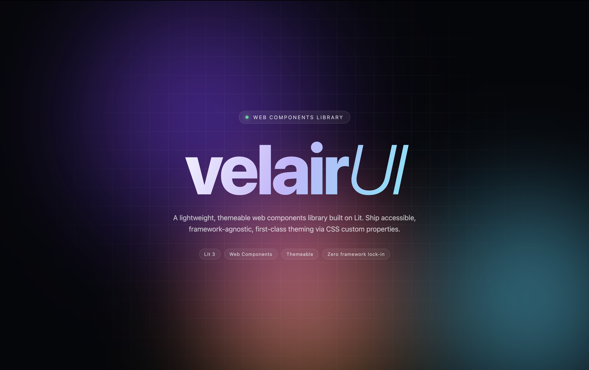

<div align="center">



# velair**UI**

**A lightweight, themeable web components library built on Lit.**
Ship accessible, framework-agnostic UI with first-class theming via CSS custom properties.


</div>

---

## ✨ Highlights

- **Framework-agnostic** — drop into React, Vue, Svelte, or plain HTML
- **Themeable** — restyle everything through CSS custom properties
- **Accessible** — keyboard navigation and ARIA built in
- **Tiny footprint** — built on [Lit 3](https://lit.dev), tree-shakeable
- **Zero lock-in** — these are real Web Components, not a framework

## 📦 Installation

```bash
npm install velair-ui lit
```

`lit` is a peer dependency — your app must provide a compatible **Lit ^3** version.

<details>
<summary>Install from a Git repository or local path</summary>

```bash
# From GitHub
npm install github:<user>/velair-ui lit

# From a local folder
npm install file:../path/to/velair-ui lit
```

In both cases you still need to add `lit` to your project dependencies.

</details>

## 🚀 Quick start

Import the components you need and a theme:

```js
import 'velair-ui';
import 'velair-ui/themes/default.css';
```

Use them as regular HTML elements:

```html
<vl-button>Click me</vl-button>
<vl-input label="Email" placeholder="you@example.com"></vl-input>
<vl-toggle-switch checked></vl-toggle-switch>
```

## 🧩 Components

| Component                    | Tag                          |
| ---------------------------- | ---------------------------- |
| Button                       | `<vl-button>`                |
| Input                        | `<vl-input>`                 |
| Textarea                     | `<vl-textarea>`              |
| Select                       | `<vl-select>`                |
| Checkbox                     | `<vl-checkbox>`              |
| Radio                        | `<vl-radio>`                 |
| Toggle switch                | `<vl-toggle-switch>`         |
| Multiple toggle switch       | `<vl-toggle-multiple-switch>`|
| Modal                        | `<vl-modal>`                 |
| Notification                 | `<vl-notification>`          |

## 🎨 Themes

Two themes ship out of the box:

```js
import 'velair-ui/themes/default.css'; // clean, neutral baseline
import 'velair-ui/themes/glass.css';   // translucent glassmorphism
```

Override any token via CSS custom properties to build your own theme.

## 🛠️ Development

```bash
npm install
npm run storybook   # start Storybook on http://localhost:6006
npm run dev         # start the Vite playground
npm run build       # build the library
```

## 📄 License

[MIT](LICENSE)
